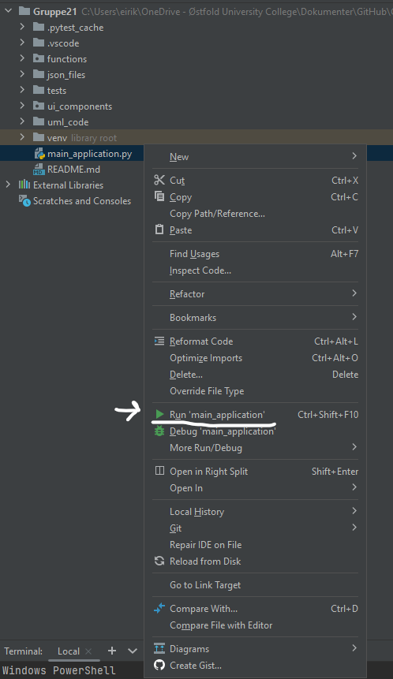
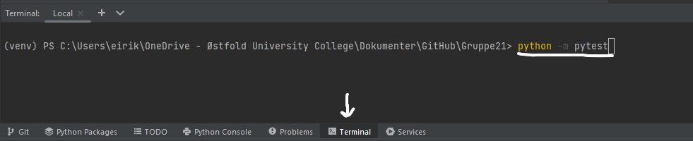

# Gruppe21
## Hvordan bruke prototypen
For å kjøre prototypen må du laste ned repositaryet og kjøpre main_application.py filen. Da vil applikasjonen åpne seg. Se bilde under:

Man kan da velge hvilken type bruker som man skal bruke applikasjonen som. Det er tre ulike typer. "User" er det som vi i prosjektbeskrivelsen kaller kunde. I vår prototype så kan kunden browse markedplassen. Kunden skal også kunne melde seg på en tur, men denne funksjonalitener er ikke implementer i vår prototype så "bestill" knappen gjør ikke stort.

Guide brukertypen kan også se på markedsplassen og skal kunne legge ut en ny tur. Denne funksjonaliteten har vi implementer i prototypen. En annen funksjonalitet som hadde planer om å implentere som vi ikke har med i prototypen er det å kunne redigere på en tur. Vi har knapp for å kunne gjøre det men den knappen har ikke funksjonalitet. 

Admin brukertypen kan også browse markedplassen. Admin brukeren har også muligheten i vår prototype til å slette de ulike turene som er lagt ut.

Selve applikasjonen er ganske simpel med et par knapper. Det er en tilbake knapp på hver side så man kan gå tilbake for å bytte brukertype. Selve markedplassen har en liste på venstre siden og når man trykker på en tur så for man opp informasjonen om den i et vindu på høre siden av applikasjonen.

Hvis man har lyst til å kjøre tester så gjør man det ved å kjøre denne kommandoen "python -m pytest" i terminalen til din IDE. I f.eks PyCharm kan man finne dette helt på bunnen av programmet. Her er et bilde på hvordan man kan gjøre det i PyCharm:

## Om prototypen
(Dette er kopiert rett ifra prosjektbeskrivelsen)

Prototypen vår er enkel å sette opp, da den kun krever installasjon av prosjektmappen og et kompatibelt IDE. Deretter lønner det seg å installere noen avhengigheter for å kunne kjøre testene hvis det oppstår noen mangler, som pytest, mock, pip, tk | tcl. Dette kan man installere ved å skrive pip “navnet på avhengigheten” i ledeteksten. Dette er fordi det har vært enkelte problemer med å kjøre testene underveis, grunnet tclError. Dette oppsto når en av medlemmene på gruppen laget en test opp mot applikasjonen. Testene fungerer som de skal, men kan kreve å bli kjørt flere ganger hvis erroren oppstår.

Når prosjektet er installert kan man enkelt kjøre applikasjonen ved å kjøre filen main_application.py. 

Når man først kjører applikasjonen, vil man ha muligheten til å velge mellom 3 forskjellige brukermoduser. Man får deretter begrenset funksjonalitet avhengig av hvem brukermodus man velger.

Vi bruker klasser og arv, slik at bruker, guider og administrator arver basisfunksjonalitet fra base_marketplace.py. Guider bygger på brukerens funksjonalitet mens administrator har muligheten til å gjøre alt guider kan og mer. 
Som bruker har man muligheten til å melde seg på turer, mens guider kan publisere nye turer. Administrator kan slette eksisterende turer.
Hvis man bruker skala på over 100 i skjerminnstillinger, vil man ikke kunne se hele applikasjonen. Noe funksjonalitet blir da komprimert dessverre, vi har ikke funnet en løsning på dette skaleringsproblemet enda.

### Minimal Viable Product (MVP)
Innloggingsfunksjonalitet der man kan velge enten bruker, guider eller administratorer er viktig for bruk og testing av applikasjonen vår og muligheten for å kunne bli tildelt en rolle i system er viktig for både bruk og testing av applikasjonen. 

Det er helt essensielt at brukeren blir vist de tilgjengelige guidede turene, kan velge en tur og melde seg på. Enda en del av vårt MVP er muligheten for guider å opprette og legge ut informasjon om en tur, inkludert navn, beskrivelse, varighet og datoer. Administrator har mulighet til å slette turer, noe som også er en essensiell del av administratorenes arbeid innad applikasjonen.
